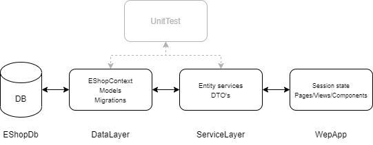
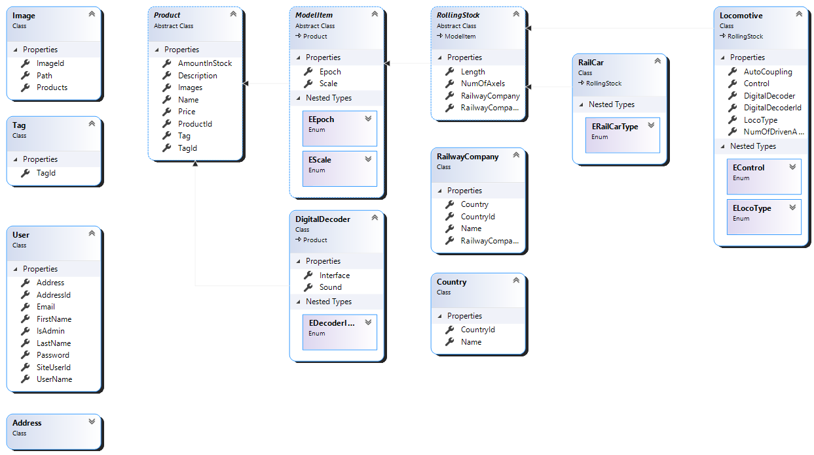
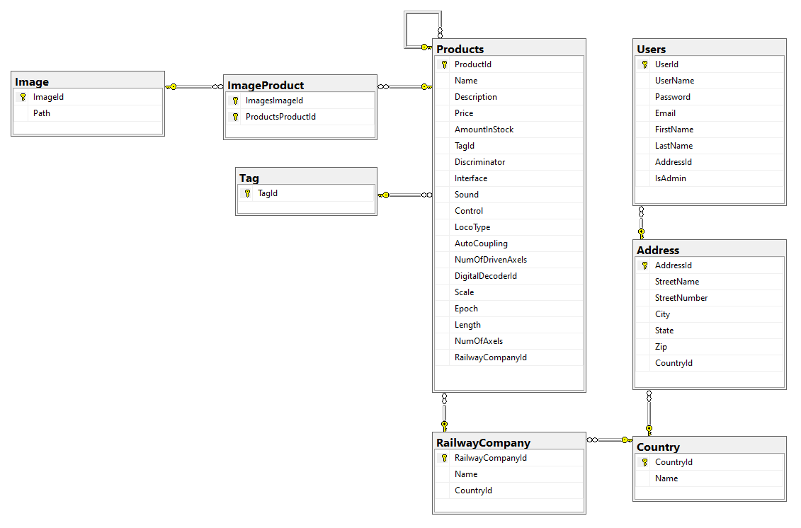

# eShop
## About

### Architecture
The basic structure of the project is allustraited in figure 1 below.



*Figure 1.0 - Project structure*

#### DataLayer
Abstract classes are used to devide different categories of products into different entities, while keeping consistency between their common properties as *products* (see class diagram in figure 2.0).



*Figure 2.0 - Class diagram*

This project implements TPH (Table Per Hierarchy), which is the standard in Entity Framework 5 (EF5).
However, the abstract classes used in this project, set the stage for a TPC (Table Per Concrete) implementation, which is *not* supported in EF5.
Therefore, as seen in the database diagram in figure 2.1, the `Product` base class is used to create one table with appropiate fields to represent any concrete class derrived herefrom, hence TPH.
A `Discriminator` shadow property of type is implicitly added to the `Product` table to distinguish between each derrived type.

Potential side effects of using TPH include;
- not being able to use required properties in derived entities, since the table is shared.
- non-nullable fields (ie. CHAR) will take up disk space regardless of what type is stored in that row. Variable length types (ie. VARCHAR) can have a data size of zero.

The looped one-to-many relation ship on the product table is caused by the `Locomotive` entity referencing one or zero `Digitaldecoder`'s, which again has a collection navigation property back to `Locomotive`.



*Figure 2.1 - Database diagram*

A TPC (Table Per Concrete) implementation would mean a table for each non-abstract class is created.
In this instance this would be `DigitalDecoder`, `Locomotive`, and `RailCar`, which all derive from `Product`. 

#### ServiceLayer
Responsible for calling the underlying database (through the DataLayer).
Retrievd entities from the database get their properties mapped into DTO's and passed to the depending application - or wise versa.
This conversion is handled by the `DtoPropertyMapper` class and brought to the application via the '<entity_name>Service' class.

The ServiceLayer contains interfaces (ie. `ILocomotiveService`) for accessing a specific service. The concrete class is conveniently located in the 'concrete' folder, from where it accesses various utility classes. These are located in both 'Utilities' (if they are shared or generic) and alongside the conrete class itself.

The `GetList<entity_name>` methods provide options for ordering, filtering, searching, and pagination.

#### WebApp
The pretty face of the project, calling methods in the ServiceLayer through injected services (`ProductService`, `LocomotiveService`, and `UserService`).
The `Startup.cs` file contains these dependency injections as well as configurations of;

- the DB context (EShopContext).
- session state and cookies.
- culture.
- routing.
- MiniProfiler (read more [here](https://miniprofiler.com/ "miniprofiler.com")).

##### Session State & Cookies
Session state is used to save user information and basket contents on the web server. Data saving, retrieval, serialization, and deserialization is done through exstension methods of the `HttpContent` class all located in the `Helpers.Session` class.
Generaly, the use of session state provides for a lightweight transfer between client and server with a single cookie.
Though, it should be kept in mind, that the web server requires more memory.

*NOTE: Note all 'gets' and 'sets' happen within the `Session` class. However, all session variable names is located here.*

##### Culture
Culture information is automaticly set from client requests. Supported cultures is, however, limited to `en` and `en-GB` only in order to enforce the usage of "." as decimal separator.

##### Administrator Rights
The preseeded admin user *(Username: admin, password: admin)* will, because of their admin rights, have a session variable set to `true`.
This will be read and acted uppon in views where admin only content can be rendered. Some models (ie. Locomotive/AddEdit) outright refuses to respond with their own view, if the user isn't an administrator.

#### WebAPI
The web API can be ran by outside VS by executing the following command from the folder in which its executable is located.
`WebAPI.exe --urls "http://*:4020"`

#### NuGet Packages & Dependecies
*ConsoleApp*
- Microsoft.EntityFrameworkCore.Design v5.0.10

*DataLayer*
- Microsoft.EntityFrameworkCore v5.0.10
- Microsoft.EntityFrameworkCore.Tools v5.0.10
- Microsoft.EntityFrameworkCore.SqlServer v5.0.10
- Microsoft.EntityFrameworkCore.InMemory v5.0.10 *(for unit testing)*
- Microsoft.Extensions.Logging.Console v5.0.0

*ServiceLayer*
- *None*

*WebApp*
- Microsoft.VisualStudio.Web.BrowserLink v2.2.0
- Microsoft.AspNetCore.Session v2.2.0
- MiniProfiler.AspNetCore.Mvc v4.2.22
- MiniProfiler.EntityFrameworkCore v4.2.22

*WebAPI*
- Microsoft.AspNet.WebApi.Core v5.2.7
- Swashbuckle.AspNetCore v6.2.3
- YamlDotNet v11.2.1
- Microsoft.AspNetCore.Components.WebAssembly.Server v5.0.11

*Blazor*
- Blazored.LocalStorage v4.1.5
- Microsoft.Extensions.Http v5.0.0

*UnitTests*
- Microsoft.EntityFrameworkCore v5.0.10

*All of the above can be installed using NuGet Package Manager or Package Manager Console (PMC): `Install-Package <package_name>` (See script below)*

##### Script
```
Install-Package Microsoft.EntityFrameworkCore.Design -ProjectName ConsoleApp
Install-Package Microsoft.EntityFrameworkCore -ProjectName DataLayer
Install-Package Microsoft.EntityFrameworkCore.Tools -ProjectName DataLayer
Install-Package Microsoft.EntityFrameworkCore.SqlServer -ProjectName DataLayer
Install-Package Microsoft.EntityFrameworkCore.InMemory -Projectname DataLayer
Install-Package Microsoft.Extensions.Logging.Console -Projectname DataLayer
Install-Package Microsoft.VisualStudio.Web.BrowserLink -Projectname WebApp
Install-Package Microsoft.AspNetCore.Session -Projectname WebApp
Install-Package MiniProfiler.AspNetCore.Mvc -Projectname WebApp
Install-Package MiniProfiler.EntityFrameworkCore -Projectname WebApp
Install-Package Microsoft.AspNet.WebApi.Core -Projectname WebAPI
Install-Package Swashbuckle.AspNetCore -Projectname WebAPI
Install-Package YamlDotNet -Projectname WebAPI
Install-Package Microsoft.AspNetCore.Components.WebAssembly.Server -Projectname WebAPI
Install-Package Blazored.LocalStorage -Projectname Blazor
Install-Package Microsoft.Extensions.Http -Projectname Blazor
Install-Package Microsoft.EntityFrameworkCore -Projectname UnitTests
```

## Usage
### Migrations & Database
*Below commands is executed using PMC in DataLayer.*

**New migration:** `Add-Migration <migration_name>`

**Undo latest migration:** `Remove-Migration`

**Update database:** `Update-Database`

**Drop database:** `Drop-Database`

**Create migration script:** `Script-Migration <script_id_> <migration_name>`

A detailed description of the above and other additional commands can be found in Microsoft Docs: https://docs.microsoft.com/en-us/ef/core/cli/powershell

The `Initial.sql` script located in `DataLayer/Migrations/Scripts` can be used to initialize the `EShopDb` database. 

## Known Issues & Limitations
- ServiceLayer doesn't provide all types of GRUD actions for all entities.
- Potentially redundant fields exist in the Address table in the DataLayer.
- Admin edit form is incomplete.
- Only one product type is actively being used.
- User creation and simulation of checkout hasn't been implemented.
- It's possible to exceed maximum stock by changing stock count for a product while it's in the basket.

## Versioning
**v0.1.1**
- Added MiniProfiler.
- Basket quick fix.

**v0.1.0**
- Initial version.